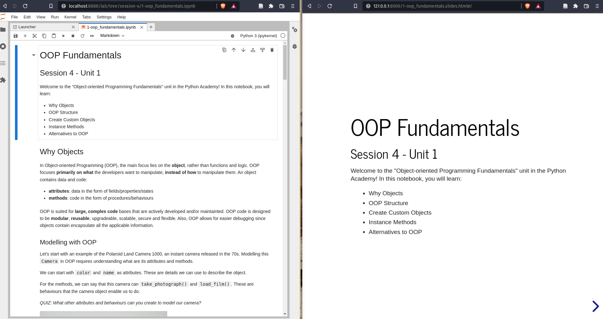
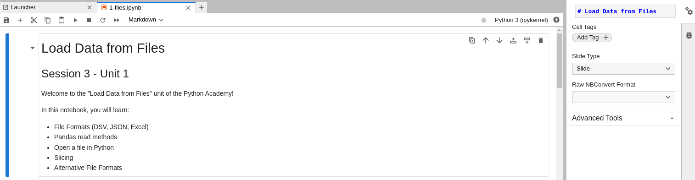
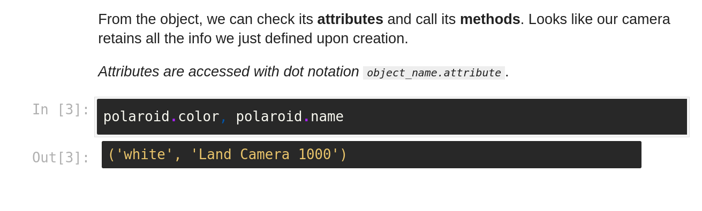

# Notebook Slides

In this tutorial, we will learn how to efficiently create slides from  a Jupyter Notebook with minimal configuration.

  

## Tutorials

- https://janakiev.com/blog/creating-slides-with-jupyter-notebook/
- https://medium.com/@mjspeck/presenting-code-using-jupyter-notebook-slides-a8a3c3b59d67
  
## Configuration

1. Install the @jupyterlab/celltags extension in your Jupyter Lab
2. After installation, you should be able to select the "Slide Type" on the right-side menu


3. After attributing a "Slide Type" to every cell, convert the cells to slides

```bash
jupyter nbconvert --to slides --post serve my_file.ipynb
```

## Slide Types

There are multiple types of slides. You are better with Slides for main topics, Sub-slides for details within each topics and Fragments for more info on the topic already presented.

1. Slide: new slide
2. Sub-slide: new slide below the last one
3. Fragment: appears within previous slide
4. Skip: skip cell, doesn't appear
5. Notes: speaker notes

## Tips and Tricks

- Slides move right, Sub-Slides move downward, Fragments appear
- Hide the cell execution number with `--no-prompt`

```bash
jupyter nbconvert --to slides --post serve --no-prompt my_file.ipynb
```

- Press `s` in your slides for Speaker Mode (timer, next slide preview)
- You can configure reveal.js in [many ways](https://revealjs-themes.dzello.com/sunblind.html?transition=zoom#/) (e.g. transition style, themes)

```bash
jupyter nbconvert --to slides --post serve --SlidesExporter.reveal_theme moon my_file.ipynb
```

- You can enable scrolling

```bash
--SlidesExporter.reveal_scroll=True
```

- You can change the CSS. Check `custom_css.md` specific tutorial on choosing font color for printed messages.
  
